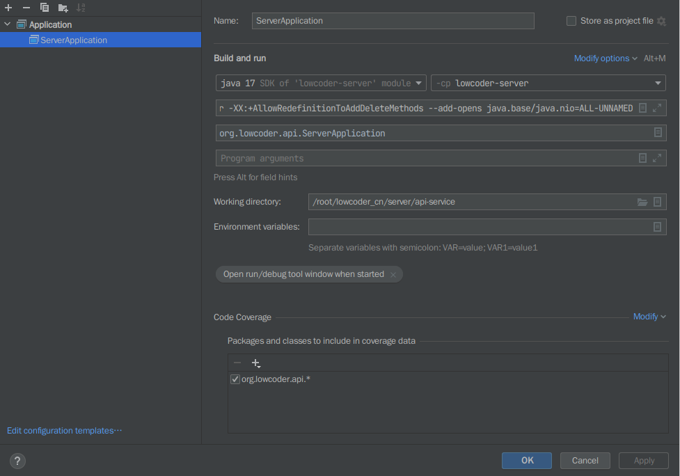

## 后端教程文档已经更新，请到文档查看后端调试教程

## Build and start the Lowcoder server jar

1. Clone Lowcoder repository
2. Next, execute the following commands in sequence

```shell
cd server
mvn clean package -DskipTests
java -Dpf4j.mode=development -Dspring.profiles.active=lowcoder -Dpf4j.pluginsDir=lowcoder-plugins -jar lowcoder-server/target/lowcoder-server-2.0.1-SNAPSHOT.jar
```


Now, you can check the status of the service by visiting http://localhost:8080 through your browser. By default, you should see an HTTP 404 error.


## Start with IntelliJ IDEA

Configure the Run/Debug configuration as shown in the screenshot below, the version used in the screenshot is IntelliJ
IDEA 2021.3.2 (Community Edition):



<table>
    <tr>
        <td style="width: 115px">JDK version</td>
        <td>Java 17  </td>
    </tr>
    <tr>
        <td>-cp </td>
        <td>lowcoder-server </td>
    </tr>
    <tr>
        <td>VM options </td>
        <td>-Dpf4j.mode=development -Dpf4j.pluginsDir=lowcoder-plugins -Dspring.profiles.active=lowcoder -XX:+AllowRedefinitionToAddDeleteMethods --add-opens java.base/java.nio=ALL-UNNAMED</td>
    </tr>
    <tr>
        <td>Main class </td>
        <td>org.lowcoder.api.ServerApplication </td>
    </tr>
    <tr>
        <td>Specify classes and packages</td>
        <td>org.lowcoder.api.* </td>
    </tr>
</table>

Next, execute the following commands in sequence

```shell
cd server
mvn clean package -DskipTests
```

After Maven package runs successfully, you can start the Lowcoder server with IntelliJ IDEA.
